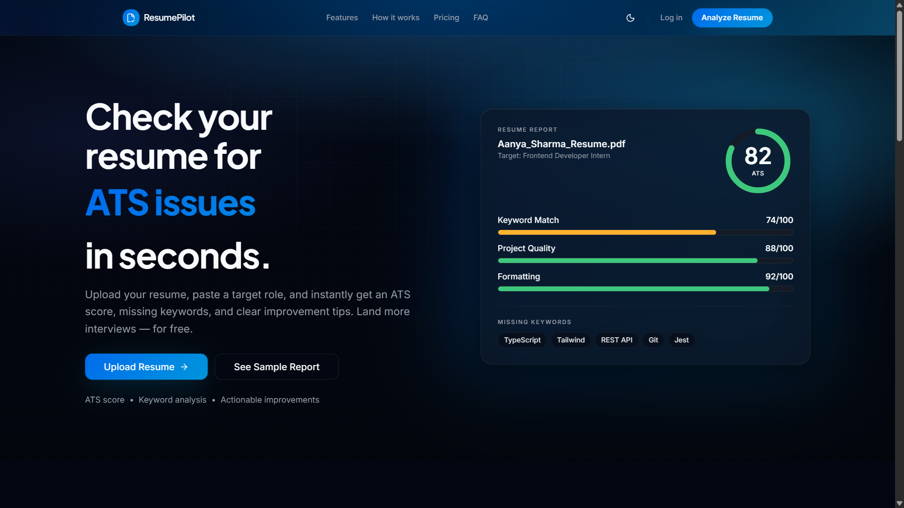
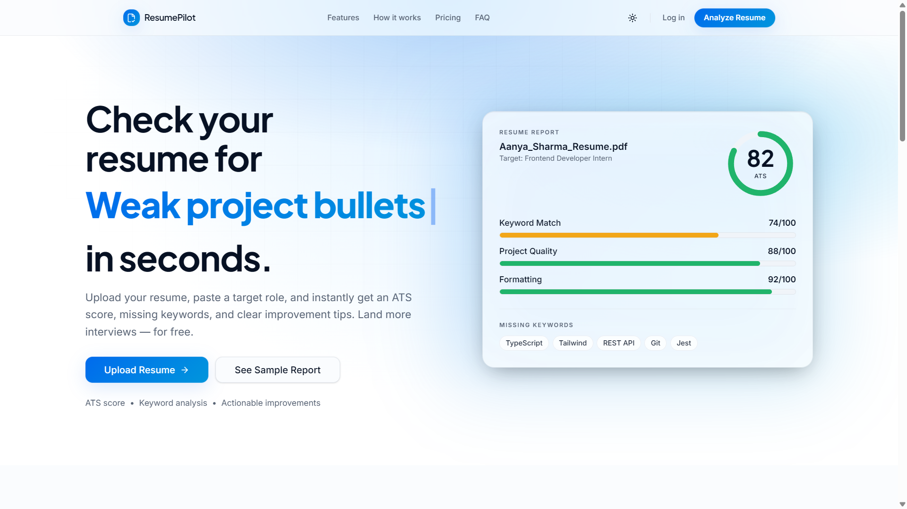

# ResumeCheck AI 🚀

ResumeCheck AI is an AI-powered ATS (Applicant Tracking System) Resume Analyzer designed for students, freshers, and job seekers. It helps users analyze resumes, identify ATS issues, detect missing keywords, improve formatting, and receive actionable suggestions to increase interview chances.

## ✨ Features

### 📊 ATS Compatibility Score
- Analyze how ATS-friendly a resume is
- Generate a score out of 100
- Detect parsing and formatting issues

### 🔍 Keyword Detection
- Compare resume content against a target job role
- Identify missing high-impact keywords
- Improve keyword matching

### 📝 Resume Review
- Review projects, skills, and content quality
- Highlight weak sections

### 🎯 Smart Suggestions
- Provide actionable recommendations
- Suggest stronger wording and improvements

### 📄 Summary & Skills Check
- Analyze summary section
- Verify skills relevance

### 🎨 Formatting Audit
- Detect:
  - Tables
  - Multi-column layouts
  - Unsupported fonts
  - Formatting issues

### 🌙 Dark/Light Theme
- Fully responsive theme switching
- Premium UI for both modes

### ✨ Interactive UI
- Cursor tracking glow effects
- Animated hero sections
- Responsive navbar
- Smooth transitions

---

## 🛠 Tech Stack

### Frontend
- React.js
- TypeScript
- Tailwind CSS
- Vite

### UI/Animation
- Framer Motion
- Custom CSS animations
- Cursor tracking effects

### AI Features
- AI Resume Analysis
- ATS scoring logic
- Keyword matching engine

---

## 📱 Responsive Design

Supports:

- Desktop
- Tablet
- Mobile devices

Optimized for:

- Dark mode
- Light mode
- Smooth user interaction

---

## 📸 Screenshots

### Dark Mode


### Light Mode


---

## ⚙ Installation

Clone repository:

```bash
git clone https://github.com/yourusername/resumecheck-ai.git
```

Go into project directory:

```bash
cd resumecheck-ai
```

Install dependencies:

```bash
npm install
```

Run development server:

```bash
npm run dev
```

Build project:

```bash
npm run build
```

Preview production build:

```bash
npm run preview
```

---

## 📂 Project Structure

```bash
ResumeCheck-AI/
│
├── public/
│
├── src/
│   ├── components/
│   ├── pages/
│   ├── hooks/
│   ├── assets/
│   ├── styles/
│   └── utils/
│
├── package.json
├── vite.config.js
└── README.md
```

---

## 🎯 Future Improvements

- Resume PDF upload
- AI-generated resume suggestions
- Resume builder
- Job recommendation system
- Authentication
- Resume history tracking
- Downloadable analysis report
- Multiple resume templates

---

## 🤝 Contribution

Contributions are welcome.

Steps:

1. Fork repository
2. Create a feature branch

```bash
git checkout -b feature-name
```

3. Commit changes

```bash
git commit -m "Added new feature"
```

4. Push changes

```bash
git push origin feature-name
```

5. Open Pull Request

---

## 📜 License

This project is licensed under the MIT License.

---

## 👨‍💻 Team

Built with ❤️ for students and freshers.

ResumeCheck AI — Beat the ATS and land more interviews.
